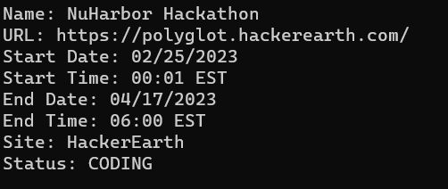

# Coding Contest

## Description

This program uses the [KNOTESTS API](https://kontests.net/api) to get in-progress and upcoming coding competitions. There are a number of different hosts and data available to be utilized, so please visit the documentation for a complete set of information.

## Hosts

There are currently 11 different hosts that are included in the API. Currently the program returns information from all the different hosts, but in the future users will hopefully be able to filter for individual hosts if they want. The hosts are:

- CodeForces
- CodeForces::Gym
- TopCoder
- AtCoder
- CS Academy
- CodeChef
- HackerRank
- HackerEarth
- Kick Start
- LeetCode
- Toph

## Attributes

This program does not return all the data available for each competition, so plese visit the websites for more information if you have questions. This program outputs the following:

- `Name`: Name of the competition
- `URL`: The URL to the competition
- `Start Date`: Start Date in MM/DD/YYYY format
- `Start Time`: Start Time in EST
- `End Date`: End Date in MM/DD/YYYY format
- `End Time`: End Time in EST
- `Site`: The host of the competition
- `Status`: CODING if the competition is in progress and BEFORE if it hasn't started yet

## How to run

The `num` argument is the one argument the user can currently tune. This argument determines how many results will be output. by default it is set to 5 results.

To run the program locally, do the following:

1. cd into the directory if not already there with `cd coding_contest`
2. run the program with `cargo run -- --num [NUM_RESULTS]`

## Output

This is an example of how the output will be structured:

## Future Improvements

- Add the ability to filter out which host you want results for as the user